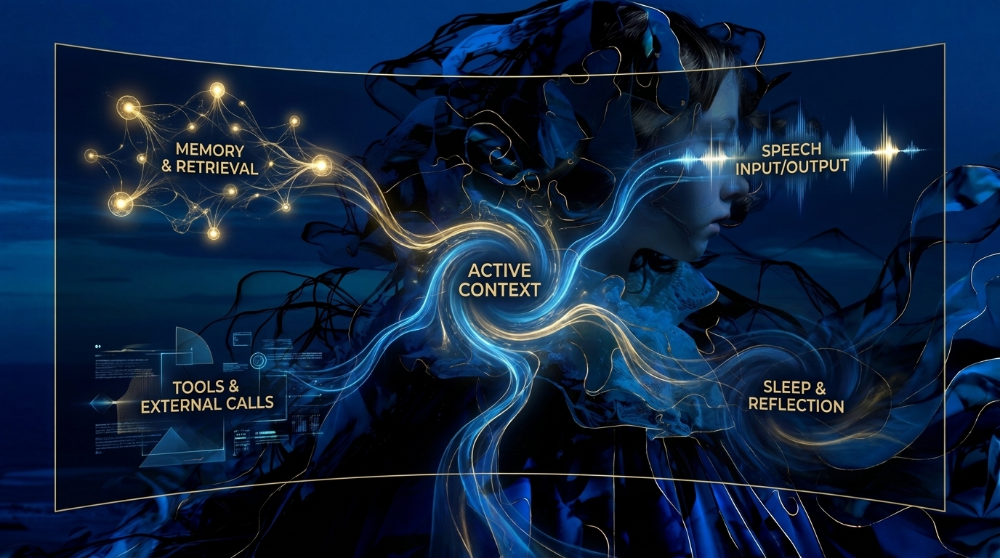

# Design: Live Activation Dashboard

## Status

Draft

## Summary

The Live Activation Dashboard is a browser-based observability surface for QSF
runtime activity. It starts as an offline replay tool that reads completed run
artifacts, projects events and traces into activation signals, and renders an
animated dashboard in a regular web browser. If replay proves useful, the same
signal and rendering model can later be used for a live dashboard that tails an
active run. In its live form the dashboard shares one web page with the live
voice-conversation controls — a single operator surface with strictly separated control
and observation planes (see Architecture).

The dashboard is a visualization layer over runtime evidence. It does not own
simulation state, mutate runtime state, make model decisions, change memory, or
execute tools.

The initial technical leaning is:

```text
Browser + TypeScript + Vite + PixiJS/WebGL + HTML/CSS overlays
```

PixiJS provides a WebGL-backed 2D rendering layer while keeping the first
prototype much simpler than raw WebGL.

## Relationship To The Idea Document

`Idea.LiveActivationDashboard.md` remains the exploratory brainstorm. It
captures the motivation, candidate channels, visual directions, future
experiments, and risks.

This document narrows that idea into an implementable design direction. It is
allowed to be incomplete, but it should be concrete enough to guide the first
prototype.

## Design Goals

- Visualize runtime evidence, not create runtime truth.
- Start with offline replay of completed run artifacts.
- Keep the event/trace-to-signal projector deterministic and testable.
- Use a regular browser as the first dashboard runtime.
- Use WebGL through PixiJS for the animated ambient display.
- Use ordinary HTML/CSS for controls, timelines, labels, and inspection panels.
- Preserve logs, traces, reports, and run artifacts as the source of truth.
- Make source events and traces inspectable from visual activations.
- Keep the first prototype small enough to discard or reshape after review.
- Co-locate the live dashboard with the live conversation controls in one web app,
  keeping the observation plane read-only and non-blocking.

## Non-Goals

- No runtime state mutation from the dashboard.
- No dashboard-controlled model decisions, memory updates, tool execution, or
  reducer actions.
- No claim that visual activation is a cognitive measurement.
- No attempt to make every event payload visible in the ambient display.
- No production-grade dashboard framework in the first slice.
- No raw WebGL implementation unless PixiJS proves insufficient.
- No live streaming dependency for the first prototype.

## Architecture

The design follows the existing QSF observability boundary:

```text
events.jsonl / traces.jsonl
  -> dashboard artifact loader
  -> signal projector
  -> replay clock
  -> activation state
  -> PixiJS/WebGL renderer
  -> browser dashboard
```

The important architectural boundary is the signal projector. It converts raw
events and trace records into a compact stream of visual activation signals.
The renderer consumes those signals, but it should not need to know the full
runtime event vocabulary.

For live use, the front of the pipeline changes but the rest should stay the
same. The realtime conversation server exposes a read-only, one-way stream of the
domain events it already handles, and the same projector consumes it:

```text
realtime server domain-event stream (read-only, one-way)
  -> signal projector (TypeScript)
  -> activation state
  -> PixiJS/WebGL renderer
```

The live dashboard renders in the same web app, at the same URL, as the live
conversation controls: one operator surface with two strictly separated planes — a
control plane (the conversation, side-effecting) and an observation plane (the
dashboard, read-only and non-blocking). The server emits domain events, never dashboard
signals, so it stays presentation-agnostic, and a dashboard failure cannot affect the
conversation.

Live streaming is a later phase. The first prototype should prove replay and
projection against sealed run artifacts.

## Browser Rendering Model

The dashboard renders in a normal browser tab. The browser provides the window,
input events, font/text stack, accessibility surface, dev tools, and deployment
shell.

The main ambient visualization is a `<canvas>` managed by PixiJS. PixiJS uses
WebGL where available and gives the dashboard a scene graph, batching, sprites,
graphics primitives, transforms, masks, filters, and custom shader escape hatches
without starting at the raw WebGL API level.

HTML and CSS remain responsible for interface elements that benefit from normal
browser layout:

- run picker
- play/pause and speed controls
- channel filters
- event timeline
- cost and latency tracks
- selected event or trace inspector
- source payload preview

This split keeps the animated visual field fast while keeping text-heavy
inspection readable and accessible.

## Technology Choices

### Browser

The dashboard should first run in a regular desktop browser such as Edge,
Chrome, or Firefox. This keeps the prototype easy to inspect, share, and iterate
on without creating a native UI shell.

### TypeScript

TypeScript should be used for the browser prototype. The dashboard has
structured data models, and types help keep runtime events, trace records,
dashboard signals, activation channels, and renderer inputs from drifting.

### Signal Projector (TypeScript, Not Rust)

The projector and activation state belong to the presentation layer, so they live in
TypeScript. Rust stays domain-pure: it emits domain events and traces, and for live use
exposes a read-only, one-way event stream — it never produces dashboard signals and
knows nothing about channels, intensities, decay curves, or colour. Rust's canonical
contract is the event/trace schema; the signal schema is a TypeScript-owned presentation
contract.

Because the server emits domain events rather than visual signals, live tail and offline
replay share one projector over one event schema: live mode reads the server's event
stream, replay mode reads a sealed run's `events.jsonl` / `traces.jsonl`, and both
produce identical signals — which also keeps the projector deterministic and unit-testable
with Vitest. Performance-sensitive work (advanced WebGL, 3D, large-graph layout) is a
TypeScript/GPU concern and, if needed, moves to a WebWorker rather than to Rust.

### Vite

Vite is the preferred first dev server and bundler. It gives the prototype a
small, conventional browser development loop without imposing a large
application framework.

### PixiJS/WebGL

PixiJS is the preferred first rendering layer. It gives QSF WebGL-backed 2D
rendering for nodes, pulses, edges, trails, glow effects, and particle-like
activation without requiring raw WebGL setup and batching in the first
prototype.

Raw WebGL remains available later for custom effects if the dashboard needs
specialized shaders. Three.js remains a later option if a true 3D view becomes
important, but the first design is a 2D research instrument rather than a 3D
scene.

### HTML/CSS Panels

Normal browser UI should handle controls and detailed inspection. The dashboard
should not try to render dense text, forms, or tables inside the WebGL scene
unless there is a strong reason.

### WebWorker Layout

A WebWorker-backed graph layout is deferred until the memory constellation view
needs it. The first replay view can use fixed regions or a simple local layout.
When graph layout becomes expensive, a worker can run force-directed or
incremental layout without blocking animation.

## Candidate Directory Shape

The dashboard lives inside the realtime server's web app rather than as a separate
project, so the live conversation controls and the live dashboard share one app shell
and one build. A likely shape, extending the existing `crates/qsf_realtime_server/ui/`:

```text
crates/qsf_realtime_server/ui/src/
  main.ts            (app shell: routes between conversation and dashboard views)
  realtime.ts        (existing conversation control plane)
  dashboard/
    qsfEvents.ts
    qsfTraces.ts
    signalProjector.ts
    activationState.ts
    pixiRenderer.ts
    timeline.ts
```

Offline replay is a mode of the dashboard view that loads a sealed run's artifacts (file
picker or a read-only artifact endpoint) instead of the live stream, and hides the
conversation controls. The first concern is still proving the
artifact-to-signal-to-visual loop.

## Data Loading

Browsers cannot freely read arbitrary local paths for security reasons. The
first prototype should use one of these loading modes:

1. Vite serves selected run artifacts during development.
2. The page offers a file picker or drag-and-drop area for `events.jsonl` and
   `traces.jsonl`.
3. A later QSF helper serves run artifacts over localhost.

The first implementation should choose the smallest mode that makes replay of
existing `runs/` artifacts comfortable.

## Signal Model

The renderer should consume dashboard signals rather than raw QSF events.

Candidate structure:

```text
DashboardSignal
  timestamp
  channel
  target_id
  intensity
  duration_ms
  label
  source_event_id
  trace_id
  metadata
```

Candidate channels for the first prototype:

```text
input
memory
context
model_role
tool
output
speech_input
speech_output
sleep
latency
cost
error
```

Not every channel needs to be rendered in the first slice. The signal schema can
include channels before the visual design fully uses them.

## Activation State

The dashboard needs derived display state so very short events remain
perceptible and repeated activity is visible.

Candidate structure:

```text
ActivationState
  target_id
  channel
  current_intensity
  last_accessed_at
  decay_half_life_ms
  reinforcement_window_ms
  source_signal_ids
```

Activation state is display state only. It is derived deterministically from the
signal stream and projector parameters. It must not be interpreted as durable
memory importance, true mental activity, or runtime state.

## Initial Event Mapping

The first projector should map existing run artifacts before adding new runtime
events.

Initial mappings:

- `ExperimentStarted` -> session/input boundary signal
- `InputReceived` -> input signal
- `MemoryRetrievalRequested` -> memory request signal
- `MemoryRetrieved` -> memory activation for selected and omitted memories
- `ContextAssemblyRequested` -> context request signal
- `ContextAssembled` -> context activation and budget signal
- `ToolRequested` -> tool outbound signal
- `ToolCompleted` -> tool return signal
- `ToolFailed` -> tool error signal
- `OutputProduced` -> output signal
- `ExperimentCompleted` -> session completion signal

Trace records can enrich these mappings with selected fragments, omitted
fragments, memory scores, association paths, latency, errors, and source
references.

## Visual Reference

The shared visual rules for QSF UI tools live in
`Design.SharedVisualLanguage.md`. This dashboard should follow that document
for palette, channel color semantics, graph styling, motion, and evidence
traceability.

The first visual north star is the activation-map concept art:



The image should be treated as inspiration for visual identity, not as a literal
interface specification. Useful design cues include:

- dark low-glare operating mode
- blue ambient substrate with warm gold activation highlights
- central active-context region as the main visual anchor
- subsystem regions for memory, tools, speech, and sleep/reflection
- luminous flows between regions to represent event-derived activation
- glow, persistence, and trail effects that map naturally to decay and
  reinforcement

The implemented dashboard should keep the same sense of ambient activity while
remaining more instrument-like than cinematic. Controls, timelines, labels, and
inspection panels should stay readable and grounded in source events and traces.

The design should avoid making the final dashboard look like a literal brain or
biological claim. Abstract regions, flows, fields, rings, and constellations are
preferred over anatomy-like presentation.

## Visual Layout For The First Prototype

The first replay should prefer a stable instrument layout over a complex graph.

Suggested layout:

```text
top toolbar: run, playback, speed, filters

main PixiJS canvas:
  central runtime region
  memory region
  context region
  tool region
  model/output region
  latency/error accents

bottom timeline:
  event ticks
  channel bands
  playback scrubber

side inspector:
  selected signal
  source event
  linked trace
```

The memory constellation view should be a later layer, not the first thing the
prototype must solve. The first question is whether activation channels over
time help a researcher understand a run faster than logs and reports alone.

## Interaction Model

The first prototype should support:

- play and pause
- replay speed control
- scrub to a timestamp
- channel visibility toggles
- click-to-inspect visual activations
- event timeline selection

All controls change only the visualization. They do not alter run artifacts or
runtime behavior.

## Phase 1: Offline Replay Prototype

Implement a local browser replay that reads one completed run's `events.jsonl`
and `traces.jsonl`.

Build:

1. JSONL loader for events and traces.
2. Typed event and trace interfaces for the observed artifact shape.
3. Deterministic signal projector.
4. Replay clock.
5. Activation state with decay and reinforcement.
6. PixiJS activation map.
7. Minimal timeline and inspector.

Verify:

- Replay existing memory and tool experiment runs.
- Confirm visible activations correspond to source events.
- Confirm selected/omitted memory and context fragments can be inspected.
- Confirm pausing and scrubbing do not change projected signals.
- Compare replay against the run report and raw JSONL artifacts.

External human review is recommended at the end of this phase because the main
question is interpretability, not only correctness.

## Phase 2: Better Signal Semantics

Refine the projector after seeing the first replay.

Potential additions:

- channel-specific intensity scaling
- minimum perceptible duration
- latency-derived trail length or heat
- memory retrieval score mapping
- selected versus omitted context styling
- error and failure flare rules
- source privacy controls

Verify:

- Projector tests cover representative event and trace sequences.
- A reviewer can identify memory, tool, context, output, and error activity
  without reading labels first.
- Visual intensity remains explainable from source data and parameters.

## Phase 3: Live Tail Dashboard

If offline replay proves useful, add a live event stream to the browser. There are two
natural sources, both read-only and one-way: the realtime conversation server's own
event stream (the live-conversation case, co-located with the controls), and a tail of an
active experiment run's append-only artifacts (the `qsf_app` experiment case).

Likely shape for the artifact-tail source:

```text
QSF run artifact writer
  -> append-only events/traces
  -> local tail process
  -> WebSocket
  -> browser signal projector
```

Verify:

- Dashboard failure does not affect the running experiment.
- Restarting the dashboard can catch up from existing artifacts.
- Live signals match a later offline replay of the same run.
- The live bridge does not bypass reducers or become a side-effect path.

## Phase 4: Memory Constellation View

Add a memory-specific graph view using retrieval results, selected context, and
association paths from traces.

Potential implementation:

- start with a simple stable layout
- add force-directed layout when graph complexity requires it
- move graph layout to a WebWorker if it affects animation responsiveness
- keep active nodes and edges more visible than dormant structure

Verify:

- Retrieved and omitted memories are visually distinct.
- Association paths pulse when trace data contains them.
- Repeated access reinforces node or edge activation before decay.
- Layout motion stays slow enough to follow activation paths.

## Phase 5: Cost And Latency Views

Add technical overlays or dedicated views for latency, token usage, and
estimated inference cost when the underlying traces provide enough data.

Verify:

- Missing cost data is labeled as unavailable rather than estimated.
- Estimated cost preserves pricing assumptions.
- Cost spikes link back to source events, traces, roles, and context sizes.

## Testing Strategy

The signal projector should receive the strongest automated testing. Renderer
tests can stay lighter at first.

Test priorities:

- JSONL parsing of existing artifacts.
- Event/trace-to-signal projection.
- Deterministic activation decay for fixed replay times.
- Channel filtering does not change source signals.
- Inspector links resolve to the source event and trace records.

Visual verification should use manual review for the first phase. Automated
browser screenshots may be useful later when the visual identity stabilizes.

## Privacy And Safety

The dashboard may display transcripts, memory summaries, tool outputs, and other
sensitive run data. The default design should avoid showing raw payload text in
the main ambient field. Detailed payloads belong in an explicit inspector.

Future live use should support a metadata-only mode for demos, screen sharing,
or long-running monitoring.

## Risks

### Renderer Becomes The Product Too Early

A beautiful WebGL surface can consume time before the signal model is useful.

Mitigation: keep Phase 1 focused on artifact loading, projection, replay, and
basic activation. Treat richer effects as polish after the projector proves its
value.

### Visuals Imply More Truth Than The Data Supports

Activation intensity may look like cognitive strength or importance.

Mitigation: define intensity as recent visual activation, expose projector
parameters, and keep source event inspection one click away.

### Live Dashboard Couples Back Into Runtime

Live streaming could accidentally become part of the experiment path.

Mitigation: consume append-only artifacts or a one-way event stream. Dashboard
failure must not affect experiments.

### Browser File Access Friction

Local file restrictions may make artifact loading awkward.

Mitigation: begin with Vite-served sample artifacts or a file picker, then add a
localhost artifact server only if needed.

## Open Questions

- Resolved: the browser dashboard lives inside the realtime server UI
  (`crates/qsf_realtime_server/ui/`), sharing the app shell with the live conversation
  controls.
- Resolved: TypeScript owns the projector and activation state; Rust stays domain-pure
  and emits domain events/traces (and a read-only live event stream), never dashboard
  signals. Rust's canonical contract is the event/trace schema; the signal schema is a
  TypeScript-owned presentation contract. Future WebGL/3D and performance-sensitive
  rendering are TypeScript/GPU concerns.
- Should the first artifact loader use a dev server, drag-and-drop files, or a
  small QSF localhost helper?
- Which run should be the first visual target: associative memory, tool as
  perception, or text-owned voice loop?
- Which channels are mandatory for the first useful replay?
- What minimum activation duration makes fast events perceptible without
  misrepresenting elapsed time?
- How should selected and omitted memories differ visually?
- What visual identity should be shared across activation map, memory graph,
  timeline, cost, and latency views?
- When should a PixiJS shader be introduced instead of built-in graphics and
  filters?
- What payloads should be hidden by default for privacy?

## Refs

- docs/Assets/LiveActivationDashboard/concept-art-activation-map-2026-05-18.jpg
- docs/Plans/Idea.LiveActivationDashboard.md
- docs/Architecture/Architecture.StateAndObservability.md
- docs/Architecture/Architecture.RuntimeLoop.md
- docs/Architecture/Architecture.MemorySystem.md
- docs/Architecture/Architecture.ToolSystem.md
- docs/Architecture/Architecture.RealtimeSessionServer.md
- docs/Plans/Plan.RealtimeVoiceConversation.md
- crates/qsf_realtime_server/ui/
- docs/DecisionLog.md
